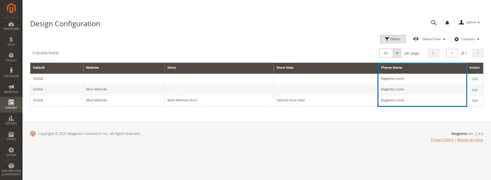
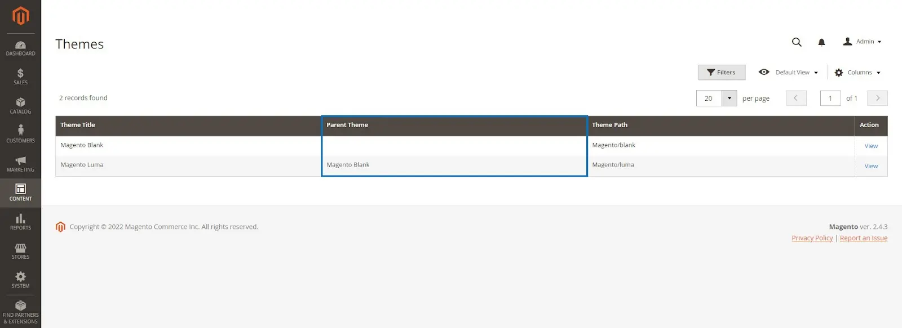

# Uninstalling Magento Modules

Uninstalling Magento Modules either extensions or themes could be a kinda senstive operation that may bring hell to your very peaceful eshop. we have primarely two types of modules, extensions and themes. each have their own safe procedures to perform on term of uninstalling.

## Extensions

Extensions are functionaility customization for magento where it may add new entities into magento or customize the existing ones. Either way, these things are represented on magento database on one way or another. So, recklessly trying to uninstalling one of the extensions may cause a huge pain for you. and make you face errors that unable to reslove until digging up the database. to remove any remainings of the module.

Since Extensions can be installed by two different ways(composer,manual). each of these ways have slightly different way of uninstalling. 

### Manually Installed

1. enable maintenance mode
```
sudo php bin/magento maintenance:enable
```

2. check if module is enabled
```
sudo php bin/magento module:status <VendorName>_<ModuleName>
```
3. if the module is enablled, disable it.

```
sudo php bin/magento module:disable <VendorName>_<ModuleName> --clear-static-content
```
4. update magento dependecies
```
sudo php bin/magento setup:upgrade
```
5. flush the cache
```
sudo php bin/magento cache:flush
```
6. remove the module code files
```
rm -rf <magento_root>/app/code/<vendor_name>/<module_name>
```
7. verify the uninstallation 
```
sudo php bin/magento module:status <VendorName>_<ModuleName>
```
8. clear any leftout from the database
    1. find any leftouts of the vendor (replace `<VnedorName>`)
        ```SQL
        SELECT attribute_id,entity_type_id,attribute_code,source_model FROM eav_attribute WHERE source_model LIKE "%<VendorName>%"
        ```
    2. delete these leftouts (replace `<attribute_id>` with ones foundout by the previous query)
    ```SQL
    delete from eav_attribute where attribute_id=<attribute_id>
    ```
9. disable maintenance mode 
```
sudo php bin/magento maintenance:disable
```
10. reset magento files permissions 

```
sudo chmod 777 var/ pub/ generated/ -R
```

### Composer Installed

1. enable maintenance mode
```
sudo php bin/magento maintenance:enable
```

2. check if module is enabled
```
sudo php bin/magento module:status <VendorName>_<ModuleName>
```
3. if the module is enablled, disable it.

```
sudo php bin/magento module:disable <VendorName>_<ModuleName> --clear-static-content
```
4. remove magento module package 
```
composer remove <vendor_name>/<module_name>
```

5. update magento dependecies
```
sudo php bin/magento setup:upgrade
```
6. verify the uninstallation 
```
sudo php bin/magento module:status <VendorName>_<ModuleName>
```
7. clear any leftout from the database
    1. find any leftouts of the vendor (replace `<VnedorName>`)
        ```SQL
        SELECT attribute_id,entity_type_id,attribute_code,source_model FROM eav_attribute WHERE source_model LIKE "%<VendorName>%"
        ```
    2. delete these leftouts (replace `<attribute_id>` with ones foundout by the previous query)
    ```SQL
    delete from eav_attribute where attribute_id=<attribute_id>
    ```
8. disable maintenance mode 
```
sudo php bin/magento maintenance:disable
```
9. flush the cache

```
sudo php bin/magento cache:flush
```

10. reset magento files permissions 

```
sudo chmod 777 var/ pub/ generated/ -R
```

## Themes

1. Ensure the Theme Isn’t Applied to a Store View


2. Verify the Theme Isn’t Set as a Parent Theme


3. (optional) backup the database if possible 

4. clear the generated classes and files 
```
rm -rf <magento_root>/generated/metadata/* <magento_root>/generated/code/*
```
5. if not set, switch to developer mode 
```
sudo php bin/magento deploy:mode:set developer

```
6. enable maintenance mode
```
sudo php bin/magento maintenance:enable
```
7. remove the theme files 
```
rm -rf <magento_root>/app/design/frontend/<vendor-name>
```
8. remove the theme records from database (replace`<user>`,`<dbname>`,`<vendor_name>`,`<module_name>` with your own)
```
mysql -u <user> -p -e "delete from <dbname>.theme where theme_path ='<vendor_name>/<module_name>' AND area ='frontend' limit 1"
```
9. clean the cache 
```
sudo php bin/magento cache:clean
```
10. disable maintenance mode 
```
sudo php bin/magento maintenance:disable
```
11. reset magento files permissions 

```
sudo chmod 777 var/ pub/ generated/ -R
```